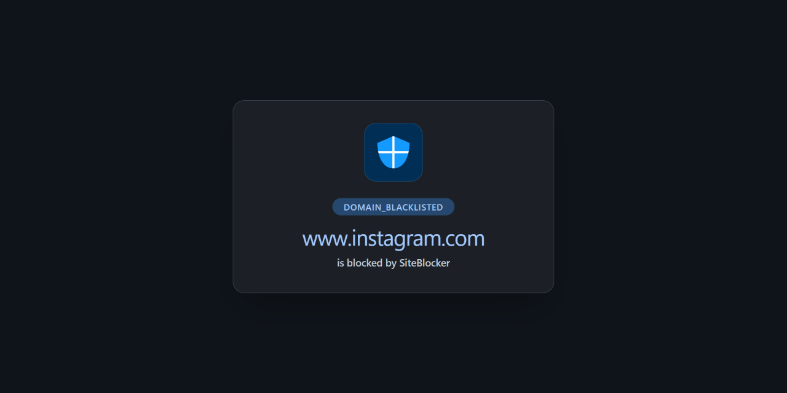

#   SiteBlocker Overview

> ### Site-guard

---

## Easy way to block distracting websites to prevent access while you work

> ### Key Features :-
- [x] URL Blocking:
Block distracting and harmful websites, including subdomains.

- [ ] Keyword Blocking:
Specify keywords or phrases; all websites containing these words will be blocked.

- [ ] White List:
Activate this option to block all websites except those included in the whitelist.

- [x] Redirect Option:
Redirect blocked sites to any specified URL

- [x] Password Protection:
Secure the options page with a password to prevent easy removal of blocked sites.

- [x] Custom Rules
Keyword based control. Allow or block access to a specific site only if the URL contains specific keyword

- [ ] Advanced Rules
Block specific resource types based on URL patterns.

- [ ] White & Black Time Configuration:
Customize your daily schedule with the Scheduling feature, allowing you to set specific days and times for accessing certain sites. Stay focused and maintain daily routines effortlessly.

